 # (25 Juli 2022)

## Array
yaitu pengelompokan data yang artinya tidak lebih dari 1 ( bersifat tunggal ) namun melainkan bersifat jamak. Kelompok datannya yaitu <i>Number, String, Objeka</i>

secara umum Array adalah mengorganisasi data dan menyimpan data apapun dan merupakan tipe data yang berurutan ( ini hanya di gunakan di java kenapa ? <i> karena di dalam java itu ketika kita mengisi Number maka tidak boleh mengisi String </i>)

<b>contoh Array</b>

tipe datanya ada 3 yaitu ( Product Manager, Front And  Developer dan Back end Developer)

>ketika kita berbicara Array maka untuk progremener dalam  menghitung urutanya yaitu dari 0 1 2 dan seterusnya hingga tipe data selesai <b> dalam pemnulisan Array di awali dengan tanda bracket [  ] untuk memulai array</b>

berikut cara penulisan Array tang tidak boleh dilakukan dikarena Array berisi Number, Sting dan Bolean

## Update Array

seperti tipe data pada umumnya ketika kita ingin menupdate sebuah variabel makan contohnya akan seperti ini 

    let number = 10
    number = 25
    console.log (number)

> dari contoh di atas nilai yang akan di tampilkan yaitu nilai 25 karena kita sudah mendevinisikan nilai 10 kemudian di update ke 25 maka nilai yang akan munvul adalah 25

## const Array
memiliki 3 hal yang perlu diketahui 
- jika menggunakan let kita dapat menambah array dengan array baru  dan konten nilai yang ada dalam arrray dengan nilai lain 
- const tidak bisa melakukan update data. Namun pada arrray  kita dapat melakukan updagte konten nilai di dalam array
- yang tidak bisa yaitu mengubah array  dengan array yang baru jika menggunakan const

> dapat di sumpulakan bahwa const memiliki sifat yang sama dengan yang lain namun const tidak bisa di ubah maka sama halnya dengan Array seperti yang dibawah ini 

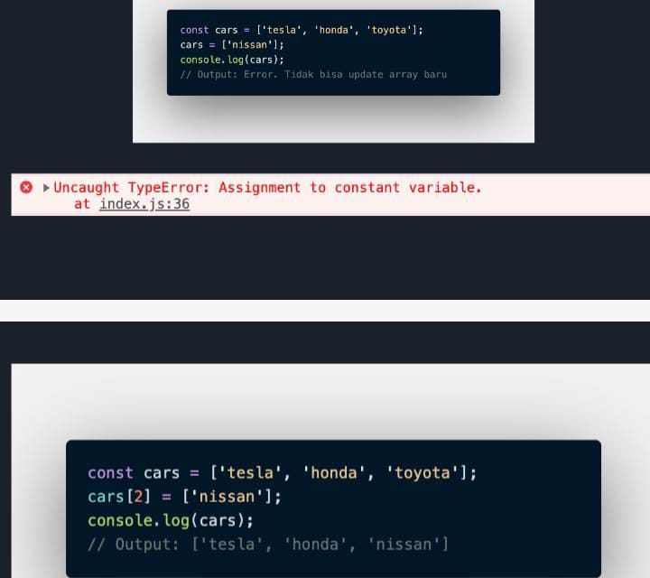
 
     dari gambar di atas bahwa jika penulisan cars = [ 'nissan' ] dan ketika di panggil maka tidak bisa di update. sedangkan jika kita menulis cars [2] = ['nisan'] maka data const dapat diupdate

## Array Properies
yaitu memiliki 5 propert yang di dalamnya adalah  <i>constructur, lenght, input dan prototype</i>

> pada materi kali yang disampaikan hanya <b> lenght </b> saja 

### Lenght
 adalah mengitungan / melihat berapa jumalah dari data pada array  andaikata ( jika lenght ada 10 maka totalnya memiliki 10 data)

 contoh  pemanggilan lenght
  menggunakan  <b>.lenght</b>
 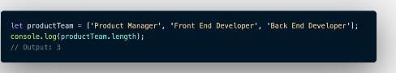
 
 ## Array Methot
 array memiloki method atau bisa disebut built-in method yang aartinya pada js kita dapat memberikan fitur untuk memmudahkan programer jika kita mau memanipulasi suatu data
 - push () adalah menambahkan item array pada urutan yang paling akhir
 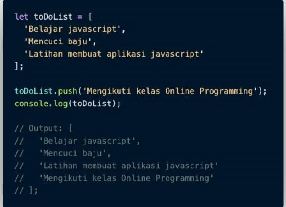
 - pop() method yang menghapus array index terakhir
  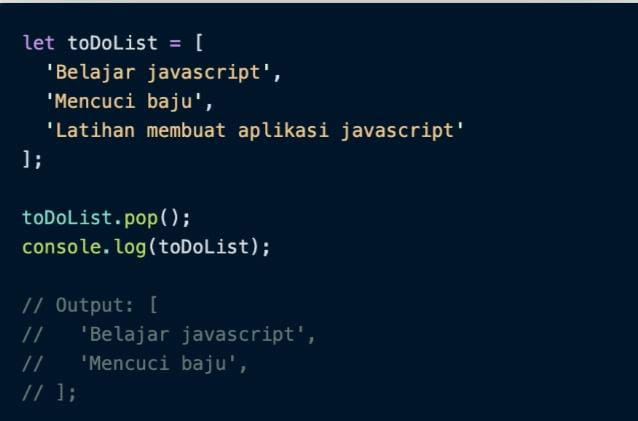
  - shift() adalah untuk mengapus array pada index pertama 
  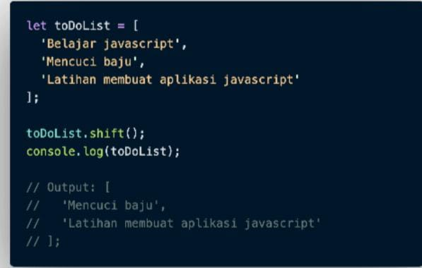
  - unshift() untuk menambahkan array untuk index pertama
  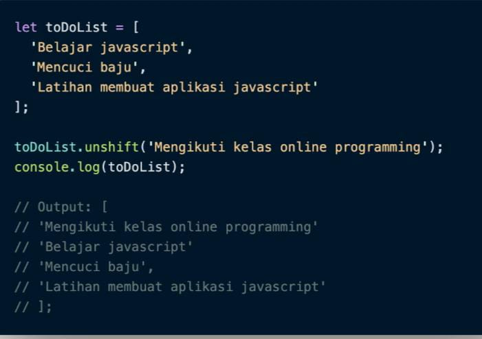
  -sort() adalah untuk mengurutkan secara ascerding atau Descarding Alphanumetric
  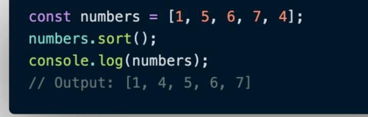

  ## Looping pada Array
  array memiliki built in method untuk melakukan loopinh yaitu map() dan forEach()
  - forEach() adalah yang melakukan looping pada setiap elemant array ( tidak mempunyai nilai balikan)

  - map() adalah melakukan perulangan dengan membuat array baru ( mempunyai nilai balikan)

# (26 Juli 2022)
## Multidimensional Array
   array yang menyimpan array lain pada setiap indeks bukan elemen tunggal. Dengan kata lain, kita dapat mendefinisikan array multi dimensi sebagai array dari suatu array

   printah Multidimensional Array
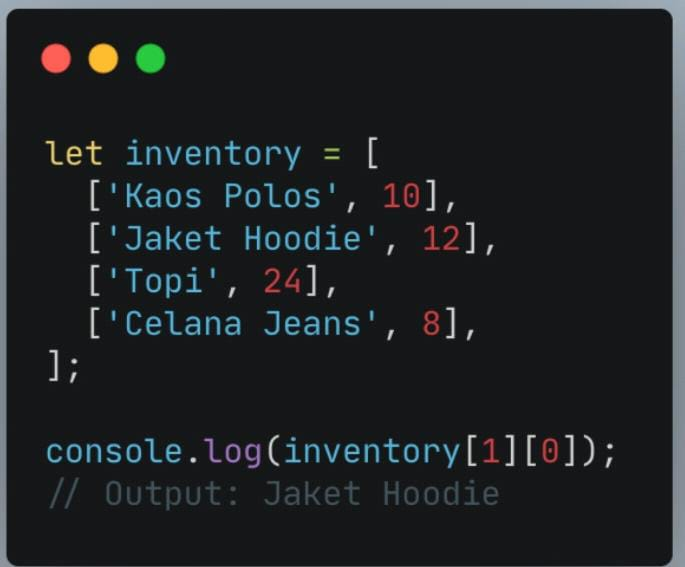

## JS Object
Dapat dianalogikan bahwa didalam dunia nyata banyak sekali objek yang kita lihat baik objek benda mati maupun objek banda hidup

jadi dalam progreming. Objek adalah sebuah tioe data pada variabel penyimpanan properti dan fingsi(method)

properti adalah  data lengkap sebuah objek  sedangkan method adalah sebuah objek apa saja yang dapat dilakukan dari suatu objek

jika diibaratkan penulisan objek dapat di disain sebagai berikut

    let aple = {
        color : red
        size : 10 
    }
sama seperti array di dalam objeck kita dapat menyimpan properti dengan tipe data apapun

mengakses array dengan properti objek 
    
    let aple = {
    color : red
    size : 10 
    }
    console.log(aple)
maka seluruh objek akan di akses

jika kita menggunakan single quote maka printahnya seperti ini

     let aple = {
    color : red
    size : 10 
    }
    console.log(aple.color);
maka properti objek yang akan di panggil adalah color

## Update Object
objek dapat di update ketika
- objek dapat di update value dari key yang tersedia
- objeka dapat menambahkan key dan value baru

contohnya 
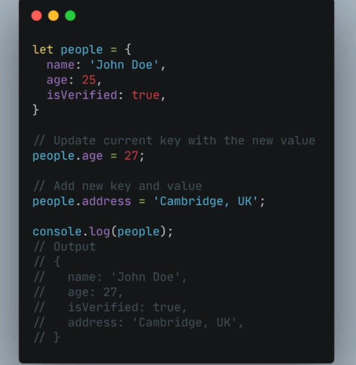

- jika menggunakan constant pada variabel objek kita tidak dapat mengganti seluruh data objek dengan objek baru 

contohnya
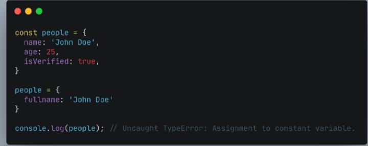

jadi jika membutuhkan untuk update seluruh data objek maka kita harus menggunakan " let " pada sat variabel dideklarasi

## Delete Properti Objek
perintah untuk menghapus onjek yaitu dngan printah  Delete
contohnya
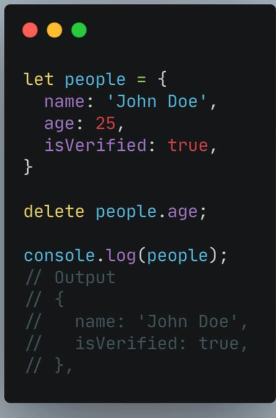

## Method
secara tidak langsung kita sering menggunakan printah console.log, secara tidak sadar bahwa printah tersebut adalah method yang dimana
( console adalah objeknya sedangkan log adalah methodnya )

## Nested objeck
adalah sebuah pengaplikasian nyata yang pastik kita menemukan data objek yang benrasal dari tutunanobjek lain

## pass by reference
yaitu dapat mengubah data yang ada pada objek melalui sebuh function dan memasukan objek sebagai parameter function 

# (27 Juli 2022)
## revursive
sama dengan loping namun kelebihan dari recursive adalah fungsi yang memanggil dirinya sendiri sampai kondisi trtentu
contohnya dalam menyelesaikan masalah matematika, fisika, kimia dan yang berhubungan dengan kalkulasi

contoh penulisanya 

    function recursive(){
        //
        recursive();
    }

kita mendafinisikan function dimana didalam function terdapat function lagi 
pada pemograman ini adalah kondisi yang biasa di temui

contohnya

    function recursive(){
        if(condition)
        recursive();
    } else {
        recursive ();
    }  

maka recursive akan berhenti dari dirinya sendiri jika sudah terpenuhi

ciri- ciri recursive
- selalu memiliki kondisi yang menyatakan kapan fungsi tersebut berhenti. kondisi ini harus dapat dibuktikan akan tercapai karena tidak jika tika tercapai maka kita akan membuaktikan bahwa fungsi akan berhenti yang berarti algoritma kita tidak benar
- memanggil dirinya sendiri saambil mengurangi atau memecahkan data masuka  setiap pemaggilanya. hal ini penting di ingat, karena tujuan utama dari recursive ialah memencahkan masalah dengan mengurangi masalah tersebut menjadi masalah kecil

contohnya
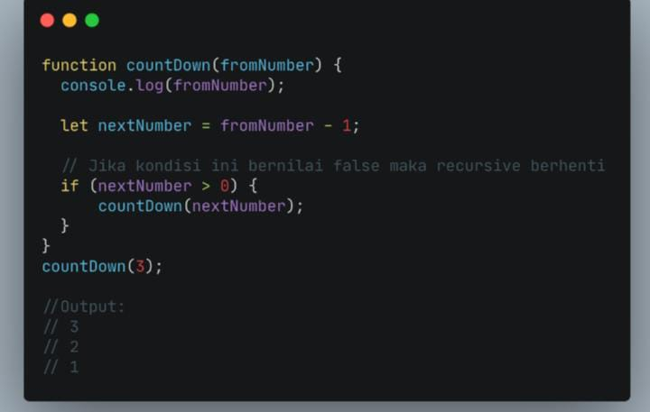

alurnya 
fromnumber = 3 kemudian masuk dalam perulangan  dimana 3 di kurangi 1 (fromnumber - 1) maka total number selanjutnya adalah 2 jika number selanjutya lebih dari 0 maka fungsinya akan di jalankan lagi, hingga nilainya 0 > 0 maka akan menghasilkan flase maka fungsi akan berhenti dijalankan 
##  js Regex (teori)
adalah susunan karakter yang dimana karakter memiliki pola untuk mencari text pada sebuah stirng atau document

contoh kasus regex

1. validasi imput dari sebuah FORM
2. mencari keywoed tertentu pada email atau halaman web
3. mencari IP address dalam kisaran tertentu
4. dan masih banyak lagi

regex juga menggunakan  built in method di dalam regex kita harus membuat polanya,, untuk polanya kita harus adanya (Literals)

<b>Literals</b> adalah konsep regex yang paling sederhana dimana kita dapt membuat regex sesuai dengan text yang kita inginkan atau mengandung text yang kita cari
##  OOP ( Object )Oriented Programing)
adalah suatu paradikma dalam pemograman yang contohnya ( paradikma prosedural, conditional hingga function)

6 type data primitive

1. string
2. number
3. boolean
4. null
5. undifined
6. symbol (ES6)

ada juga yang disebut reference type:
1. object
2. function
3. array

opp adalah Principle. yang dimana dapat diterapkan pada bahasa pemograman selain js seperti ruby, python, dan java

##  This Keyword
adalah sebuah keyword khusus yang merujuk pada objek pemilikinya

maksudnya adalah nilai dari this sangat berganting pada keyword this ini di letakan atau dipanggil

jika this digunakan dalam sebuah method maka dia akan merujuk pada pemiliknya

 jika this didalam sebuah function maka ia akan merujuk pada global objek

 dalam kasus function contractor dan class maka keyword this ini mengacu pada objek instanya

 4 pilar yang menjadi tumpuan dari object oriented progreming

 1. pilar encapulation  adalah cara untuk mengatasi akses langsung ke properti atau method dari sebuah object
2. pilar inheritance adalah sebuah proses dimana sebuah class mewarsikan property dan methodnya ke kelas lain
3. pilar polymorpishm dikenal sebagai konsep OOP yang berarti kemampuan dari suatu objek untuk memiliki banyak bentuk, pilar ini method yang diwariskan bisa diubah dengan cara yang berbeda menyesuaikan dengan class yang kita buat
4. pilar abstraction adalah sebuah teknik untuk menyembunyikan  detail tertentu dari sebuah objek / method dan hanya menampilkan fungtionalitas atau fitur penting dari objek tersebut

##  Modules
adalah reucable code yang dapat di export sari satu file js dan di import ke file js yang lain  
sebelum mekakukan export dan impor file js yang perlu kita ketahi dia dalam index.html hanya menambahkan printah modules

pritahnya adalah 
langkah 1 harus membuat devinisi atributnya seperti dibawah ini 

    <scrip type ="module" src = "nama.js"></scrip>

langkah 2 kita harus membuat variabel  nama cvariabelnya const.jd contoh perintahnya

     export const phi = 3.14

ketika kita ingin menggunkakan const di nama.js maka yang harus diunakan adalah dengan printah :

    import {phi} from ".conts";
    console.log(phi);

maka secara otomatis nilai yang ada di conts phi akan kita dapatkan di nama.js jika di pangil 

# (28 Juli 2022)

## jenis Web Storage
1. local Storage
2. session storage
3. indexDB
4. cookies
5. trust token
6. web SQL

> web storage terdapat di web bersngkutan web datanya lebih mengikat ke web browser

yang umumnya yang di gunakan oleh front end yaitu:
1. local Storage
2. session storage
3. indexDB

yang harus dikomunikasikan oleh BE yaitu cookies

## perbedaan local Storage dan session storage
local Storage
bersifat permanen walaupun di close maka data akan tetap tersimpan  sedadngkan session storage
bersifat tidak permanen selama kita tidak kluar dari webnya

> <b>printah menyimpan data ke local storage</b>
    
    let token ="1325346tdgerg";
    localStorage.setItem ("token", token)

 <i> setItem adalah perintah untuk menyimpan suatu data ke local storage</i>

 <i> "token" adalah nama key yang ada di local storage</i>

 <i> token merupakan value (1325346tdgerg) </i>

> <b>printah mengambil data ke local storage</b>

    console.log(localStorage.getItem("token"));

    

 <i> getItem adalah perintah untuk mengambil suatu data ke local storage</i>

> <b>printah menghapus data dari local storage</b>

    locarStorage.removeItem ("token")
maka value token akan terhapus dan tidak akan kembali lagi 

<i>ketika kita ingin mengganti Local/session storagr kita hanya perlu mengganti nama awalnnya saja contohnya

    localStorage.setItem ("token", token)

    diganti ke

    sessionStorage.setItem ("token", token)
 </i>

## cookies
adalah data basic akan melakukan  perintah lockout sendiri jika waktu maksimal data yang akan dibuka namun data tersebut tidak dilakukan aktifitas apapun maka secara otomatis akan kluar dan harus login kembali hal ini supaya data yang kita buka sebagai pengaman jika kita lupa keluar dan tidak di salahgunakan orang lain 

# (29 Juli 2022)
## Synchronous programming

Synchronous  adalah cara mengerjakanya yaitu step by step
    
    const name = 'Miriam';
    const greeting = `Hello, my name is ${name}!`;
    console.log(greeting);

    // "Hello, my name is Miriam!"

dari perintah tersebut maka dia memmanggil secara berurutan 

kode dia atas diantaranya :
1. Mendeklarasikan string yang disebut name.
2. Mendeklarasikan string lain yang disebut greeting, yang menggunakan name.
3. Menampilkan salam ke konsol JavaScript.

# Asynchronous 
 adalah cara mengerjakanya yaitu dengan cara pararel

 kenapa kita harus menggunakan ?
 Asynchronous dikarenakan ketika kita melakukan proses yang membutuhkan waktu yang lama.

 kapan kita menggunakannya?
 salah satunya yaitu ketika kita melakukan pengambhilan data dari data base

 ketika kita tidak menggunkan Asynchronous maka data ini akan keburu ditampilkan karena datanya masi kosong disebabkan data yang ada didata base belum terambil

## Introduction to web API
Application Programming Interfaces (API) adalah konstruksi yang tersedia dalam bahasa pemrograman untuk memungkinkan pengembang membuat fungsionalitas yang kompleks dengan lebih mudah. 

## web Service
adalah sebuah penyedian layanan web API tetapi memiliki aturan terkaid dengan layanan yang di akses

## REST ()